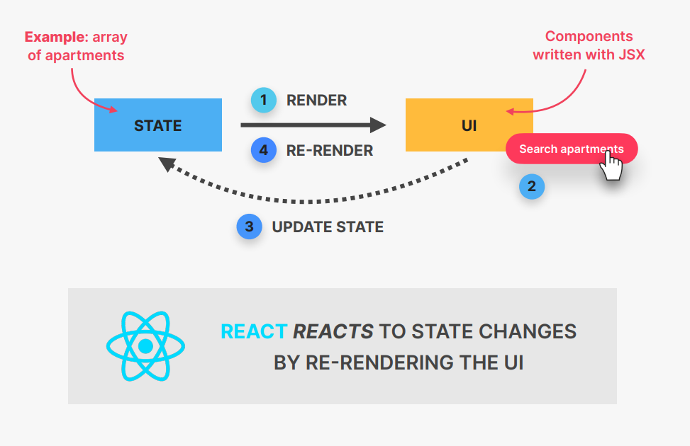

# A First Look at React

## WHAT IS REACT?


### React is based on components


### React is declarative


- 我们使用一种叫做JSX的声明性语法来描述组件的外观和工作方式；

- 声明式：根据当前数据/状态，告诉React组件应该是什么样子；

- React是远离DOM的抽象，我们从来不碰DOM；

- JSX-结合HTML、CSS、JavaScript以及引用其他组件的语法；

### React is state-driven


### React is JavaScript Library


### React was created by facebook


### summary


## THE TWO OPTIONS FOR SETTING UP A RECT PROJECT


### create react app

```bash
npm install -g create-react-app // 全局安装 create-react-app

npx create-react-app my-app // 创建一个新的 React 项目
```

### Vite

```bash
npm create vite@latest my-react-app --template react
```

# Working With Components, Props and JSX

## `<React.strictMode>`
`<React.strictMode>` 是 React 提供的一个工具组件，用于突出显示应用程序中的潜在问题。不会渲染任何可见的UI，而是对其内部的所有组件执行额外的检查和警告。

`<React.strictMode>`可以帮助发现以下问题: 
- 识别不安全的生命周期方法：在未来的 React 版本中，某些不安全的生命周期方法可能会被弃用。
- 关于副作用的警告：帮助你在组件挂载之前检测意外的副作用。
- 关于过时 API 的警告：提醒你使用过时的 API。
- 检测意外的副作用：确保组件在开发模式下不会产生意外的副作用。
- 检测遗留字符串 ref API 的使用：帮助你迁移到新的 ref API。
- 检测不稳定的 key：帮助你检测在列表中使用不稳定 key 的情况。

## COMPONENTS AS BUILDING BLOCKS


## WHAT IS JSX?


## Props

### Props 用于将数据从父组件传递到子组件（在组件树中向下）


### 使用 Props 父组件可以控制子组件是如何工作和展示的，是配置和自定义组件的重要工具，就像函数的参数一样


### 任何东西都可以作为 Props 传递：单个值、数组、对象、函数，甚至其他组件


### 只读 Props are read-only


### 单向数据流 One-Way data flow


## Rule of JSX


### general jsx rules

- JSX 类似于 HTML，使用 `{}` 进入 `JavaScript` 模式；

- 我们可以将 `JavaScript` 表达式放在 `{}` 中。例如：引用变量、创建数组或对象、[].map() 、三元运算符...

- 不允许使用 `if/else`、`for`、`switch`

- JSX 生成一个 JavaScript 表达式
    - 可以在 `{}` 里面放置其他 JSX 片段
    - 可以在组件内的任何地方编写 JSX

- 一段 JSX 只能有一个根元素，如果需要更多使用 `<React.Frament>`

### difference between JSX and HTML

- `className` 代替 HTML 中的 `class`

- 每个标签都需要闭合

- 事件和属性使用驼峰命名：`onMouseOver`、`onClick`。例如：aria-*和data-*像 HTML 一样用破折号写

- CSS 属性名也使用驼峰命名

- 注释需要在 `{}` 因为是 `JS`

## `<React.Fragment>`

`<Frament>` 允许你在不向 DOM 添加额外节点的情况下，将子元素分组。因为 `JSX` 要求只能返回一个根元素。

## Summary


# State, Events, and Forms: Interactive Components

## What is State

- State 相当于组件的大脑，可以记忆


## The mechanics of state


# Thinking In React: State Management

## Thinking In React


## Local State VS Global State


## State：When And Where?


## Child-To-Parent Communication


## Deriving State


## The Children Prop


# Effects and Data Fetching 

## Component Lifecycle


## 