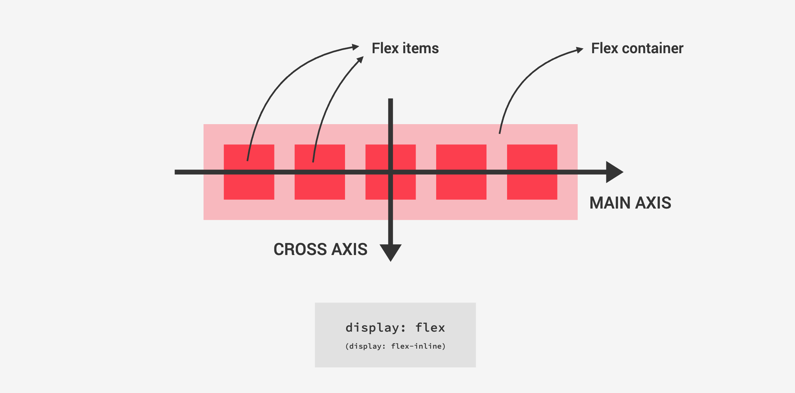
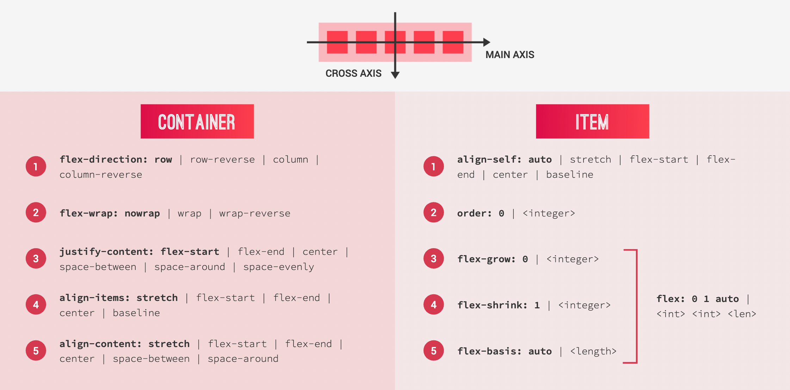

#

## Cascade

级联：当多个规则应用于某个元素时，组合不同样式表并解决不同 CSS 规则和声明之间冲突的过程。

CSS 通常的来源有：Author 开发人员编写、User 用户自定义、Browser 浏览器默认声明。

重要程度排名：

1. User _!important_ declarations
2. Author _!important_ declarations
3. Author declarations
4. User declarations
5. Browser default

当重要程度相同时比较权重，权重排名：

1. Inline style
2. IDs
3. Classes、pseudo-classes、attribute selectors
4. Elements、pseudo-elements

权重的计算方式，按上面序号分别对应每一位数字(0, 0, 0, 0)

当权重相同时比较声明的先后顺序，后面的声明会覆盖前面声明的样式。

## 020 BEM 命名 和 sass 文件夹目录划分

## 033 响应式的四个原则

## 响应式图片

响应式图片是指能够根据用户设备的屏幕尺寸、分辨率和像素密度等因素自动调整自身显示效果的图片。

作用：

1. 在小屏幕设备上，使用较小尺寸的图像可以避免图像过大而导致页面加载速度缓慢，同时更好地适应屏幕布局，避免出现滚动条和图像溢出等问题，提高用户在移动设备上的浏览体验。
2. 在高分辨率设备上，使用高分辨率的图像可以保证图像的清晰度，避免出现模糊的情况。

实现：

1. 使用 img 元素的 `srcset` 和 `sizes` 属性：

   ```html
   
   ```

   ```html
   
   ```

   sreset 属性提供不同尺寸的图片，sizes 属性提供不同尺寸的图片在不同屏幕尺寸下的显示宽度。

2. 使用 `picture` 元素 和 `source` 元素

```html
<picture class="footer__logo">
  <source
    srcset="img/logo-green-small-1x.png 1x, img/logo-green-small-2x.png 2x"
    media="(max-width: 37.5em)"
  />
  
</picture>
```

```html
<picture>
  <source media="(max-width: 799px)" srcset="small.jpg" />
  <source media="(min-width: 800px)" srcset="large.jpg" />
  
</picture>
```

`picture` 元素作为容器，包裹 `source` 和 `img` 元素，用于根据不同的媒体条件选择不同的图像源。

`source`元素：media 属性用于指定媒体查询条件，srcset 属性用于指定不同的图像源。

`img`元素：作为后备，当不满足 source 元素的媒体查询条件或浏览器不支持 source 元素时，使用 img 元素的 src 属性指定图像源。

## Flex Box

### Flex Box Concepte



### Flex Box Properties



## 常用的 css pseudo-class 选择器

#### `:root` 匹配文档树的根元素。

使用 `:root` 选择器可以定义全局的 CSS 变量，这些变量可以在整个文档中使用，并且可以通过`var()`函数来引用。

#### `:hover` 匹配鼠标悬停在元素上的元素。

#### `:focus` 匹配获得焦点的元素。

#### `:link` 匹配未访问过的链接元素。

#### `:visited` 匹配已访问过的链接元素。

#### `:active` 匹配被激活的元素。
